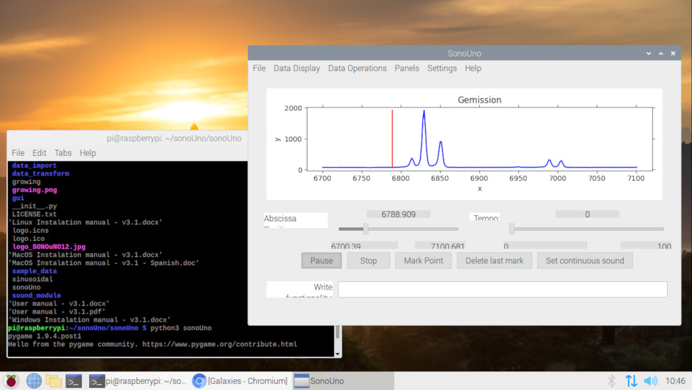
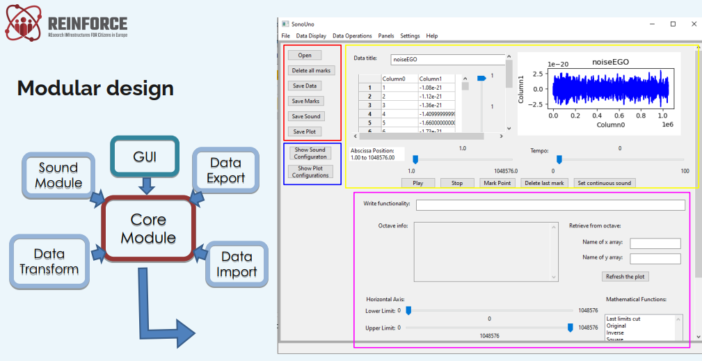
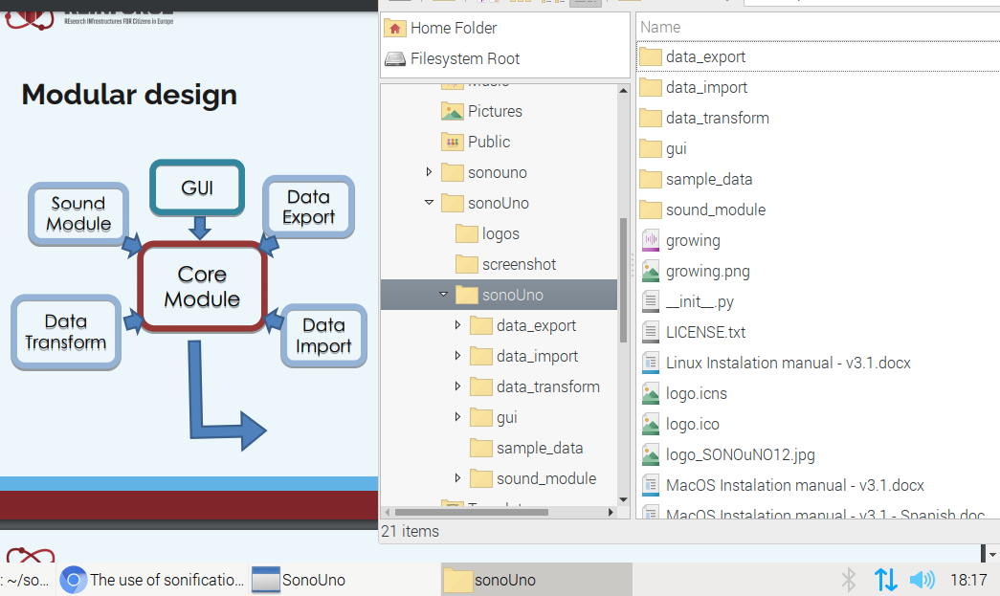

# SonoUno-Raspberry-Pi

Note on building and exploring how SonoUno works on a Raspberry Pi

The project is inspired by a BCC podcast about exploring the universe with sound. 

https://www.bbc.co.uk/programmes/p09mg44c

(Gemission data is from http://sion.frm.utn.edu.ar/sonoUno/index.php/galaxies/) 

## Hardware

Raspberry Pi 4 Model B (tested) 

(one Raspberry Pi OS for all Pi models) 

https://www.raspberrypi.org/products/

## Software

Raspberry Pi OS with desktop 
Release date: May 7th 2021 
Kernel version: 5.10 
Size: 1,180MB 

## Building SonoUno on a Raspberry Pi

Using "Installation" in 

https://github.com/sonoUnoTeam/sonoUno

as a starting point. 

Here is the author's note on building sonoUno on Raspberry Pi OS with desktop. 

In Terminal, 

sudo apt-get update

git clone https://github.com/sonoUnoTeam/sonoUno.git

cd sonoUno 

sudo apt install libsdl2-mixer-2.0-0 libsdl2-image-2.0-0 libsdl2-2.0-0 libsdl-ttf2.0-0 libgtk-3-dev 

python3 -m pip install -U wxPython 

(~80min for Pi4 to compile wxPython, author's Pi4 gives a "flashing thermometer" warning so a fan is used) 

(command "/opt/vc/bin/vcgencmd measure_temp" gives cpu temp) 

python3 -m pip install pandas 

sudo apt-get install libatlas-base-dev 

python3 -m pip install oct2py 

sudo apt-get install octave 

pip3 install matplotlib 

cd sonoUno 

python3 sonoUno 

(some commands are "out of order" but that's what happen when one interactively, "pip3" or "apt-get" missing software until "python3 sonoUno" works.) 

## Exploring how SonoUno works

The sonoUnoTeam has made sonoUno easy to tinker with. 

File "The use of sonification in REINFORCE" explains its design: 

In directory ./sonoUno/sonoUno, each subdirectory has the corresponding module (eg. directory sound_module to "Sound Module").  

We will be exploring simple_sound.py in ./sound_module to learn how it generates sound from numbers. 

## References

https://www.raspberrypi.org/products/raspberry-pi-4-model-b/

https://www.raspberrypi.org/software/operating-systems/

BBC Radio 4 Scientifically... podcast "The Blind Astronomer" 

https://www.bbc.co.uk/programmes/p09mg44c

https://reinforceeu.eu/

https://reinforceeu.eu/events/webinars/how-help-scientists-gravitational-wave-noise-hunt

File "The use of sonification in REINFORCE" explains sonoUno from YouTube webinar "How to help scientists in the Gravitational Wave noise hunt" 

https://reinforceeu.eu/sites/default/files/2020-09/The%20use%20of%20sonification%20in%20REINFORCE%20-%C2%A0Beatriz%20Garcia.pdf

http://sion.frm.utn.edu.ar/sonoUno/

https://github.com/sonoUnoTeam/sonoUno

A November 2019 blog about heat and Pi 4 

https://www.raspberrypi.org/blog/thermal-testing-raspberry-pi-4/
